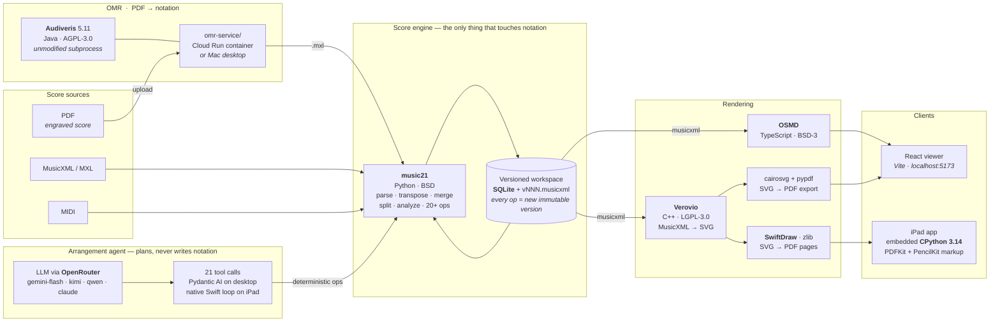

# Scoranger

**Chat-driven musical score arrangement.** Drop in a score (MusicXML, MIDI, or a
PDF via OMR), then ask an AI agent for a new arrangement — *"keep the violins,
turn the viola and cello into an accordion left hand, add chord symbols"* — and
watch the engraved result update live, with every step versioned and exportable
to PDF.

This is a working local prototype. The core bet, backed by 2025–26 research:
**the LLM never writes notation.** Frontier models score ~47–49% on full-score
comprehension benchmarks (MSU-Bench) and corrupt notation when editing it as
text — but an LLM agent calling deterministic score-editing tools hit 99.6% on
a precise-editing benchmark (ScoreSpeak, Cal Poly 2025) vs 75.4% for direct
text editing. So the agent *plans*; [music21](https://github.com/cuthbertLab/music21)
*executes*; every mutation is an immutable, inspectable version.

```
INGEST                          LIBRARY (versioned)              AGENT LOOP
MusicXML/MIDI ──(import)──┐
                          ├──►  SQLite (Firestore-shaped     Claude Code (or any LLM)
PDF ──(Audiveris OMR)─────┘     docs) + .musicxml artifacts    │ reads: parts, ranges, per-bar
                                     │                         │        harmony analysis
VIEW / EXPORT                        │                         │ calls: deterministic music21 ops
React + OSMD (live)  ◄───────────────┴──────────  new version ◄┘ (keep/merge/split parts, transpose,
PDF per voice (Verovio)                                          re-instrument, chord symbols, ...)
```

## What it does today

- **Import** MusicXML / MXL / MIDI (drag into the UI or CLI); PDF scores via
  [Audiveris](https://github.com/audiveris/audiveris) OMR (clean engraved PDFs
  convert near-perfectly)
- **Arrange via deterministic ops** — each one range-aware, clef-aware, and
  verified: part extraction/removal, transposition, instrument reassignment
  (auto octave-fit + idiomatic clef), lossless part merging (voices), bass/chord
  staff splitting, playability constraints, tie cleanup
- **Analyze harmony** — per-bar chord candidates (duration-weighted pitch-class
  template matching) that the agent adjudicates into a chord chart, written back
  as real MusicXML chord symbols
- **Version everything** — every operation creates an immutable version with a
  parts snapshot; click through history in the viewer, compare, export any state
- **Live viewer** — React + [OpenSheetMusicDisplay](https://github.com/opensheetmusicdisplay/opensheetmusicdisplay);
  auto-follows the latest version as the agent works
- **Export PDF** — whole score or any subset of voices (checkboxes), engraved by
  [Verovio](https://www.verovio.org/) — no MuseScore dependency
- **Standalone iPad app** (`ios/`) — the entire engine runs **on-device**:
  embedded CPython 3.14 + music21 behind a JSON bridge, Verovio compiled in for
  rendering, a native chat agent over OpenRouter, Apple Pencil markup per page.
  No laptop or server required; a Settings toggle can still point it at a Mac
  running `scor serve`.

## Quickstart

```sh
# engine (Python 3.10+)
python3 -m venv engine/.venv
engine/.venv/bin/pip install -e engine
engine/.venv/bin/pip install verovio cairosvg pypdf pymupdf   # PDF export + tooling

# demo score + services
engine/.venv/bin/python engine/scripts/make_demo.py
engine/.venv/bin/scor serve &          # local API :8765 (uploads/exports)
cd viewer && npm install && npm run dev # viewer at http://localhost:5173
```

Then either click **New…** in the viewer to import a score, or drive the engine
from the CLI:

```sh
scor() { engine/.venv/bin/scor "$@"; }
scor import my-quartet.musicxml
scor info my-quartet
scor remove-parts my-quartet --parts "Piano"
scor change-instrument my-quartet --part Violoncello --to Viola
scor export my-quartet --format pdf --parts "Violin I" --out violin1.pdf
```

**The chat agent:** open this repo in [Claude Code](https://claude.com/claude-code)
and just ask for arrangements in natural language — `CLAUDE.md` teaches the
agent the tools and the house rules (orient first, state the plan, verify
ranges, relay reports). The same tool layer is designed to sit behind a hosted
agent loop later.

For PDF (OMR) ingestion, install Audiveris and see `CLAUDE.md` → *PDF ingestion*.

## How a score flows through the system



External dependencies at a glance: **Audiveris** (AGPL, isolated as an
unmodified subprocess in its own container), **music21** (BSD, the only code
allowed to mutate notation), **Verovio** (LGPL, engraving), **OSMD** (BSD-3,
web rendering), **SwiftDraw** (zlib, iOS rendering), **CPython** via BeeWare's
iOS build (PSF), and **OpenRouter** as the model gateway (the LLM is a config
choice, not an architecture choice). The iPad app runs the entire engine
on-device; only OMR (and the LLM) are network calls.

## Design

- **`engine/`** — Python. `ops.py` holds the deterministic score operations
  (the future product API); `workspace.py` + `db.py` are a Firestore-shaped
  document store (SQLite locally; swap in a `FirestoreRepository` to go to
  Firebase without reshaping data); `render.py` is the Verovio PDF pipeline;
  `server.py` is the thin local API the viewer talks to.
- **`viewer/`** — Vite + React + OSMD. Read-only rendering by design (a
  notation editor is a different product); polls a manifest projection of the DB.
- **`ARCHITECTURE.md`** — the full product design and the research appendix
  (OMR landscape, symbolic-music model benchmarks, tooling ecosystem, with
  citations). **`BACKLOG.md`** — what's deliberately deferred (Firebase, hosted
  chat, photo OMR, generative arrangement models).

## License notes

The app is original code. music21 (BSD), Verovio (LGPL), OSMD (BSD-3) are
dependencies; Audiveris (AGPL) runs as a separate unmodified process. Scores
you import stay in `workspace/` and `intake/`, which are gitignored — mind the
copyright of anything you feed it.
